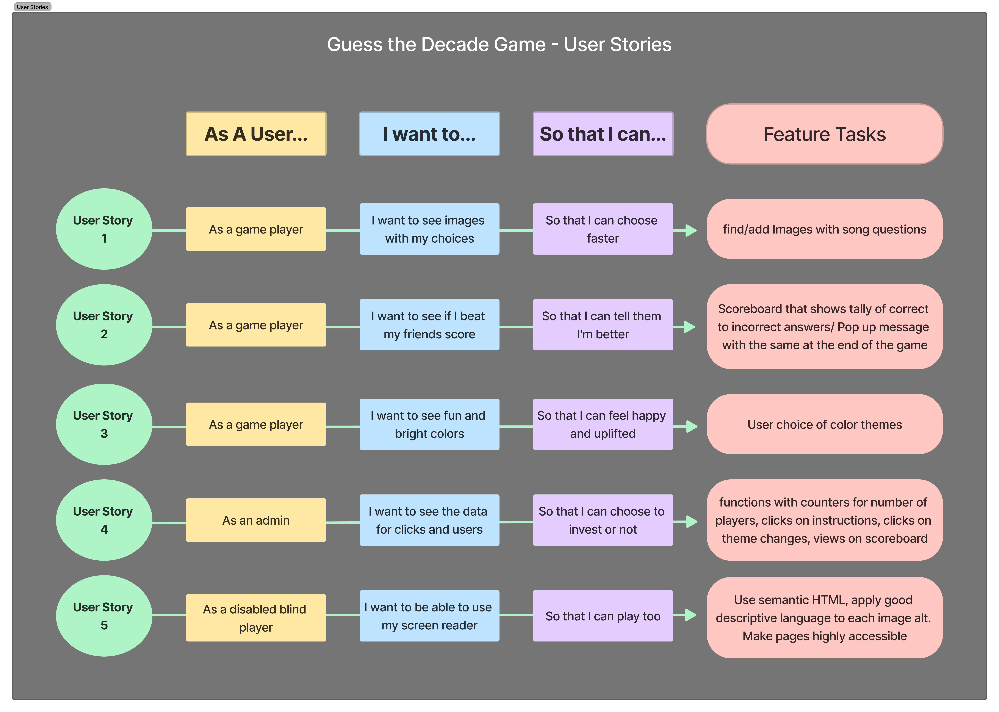
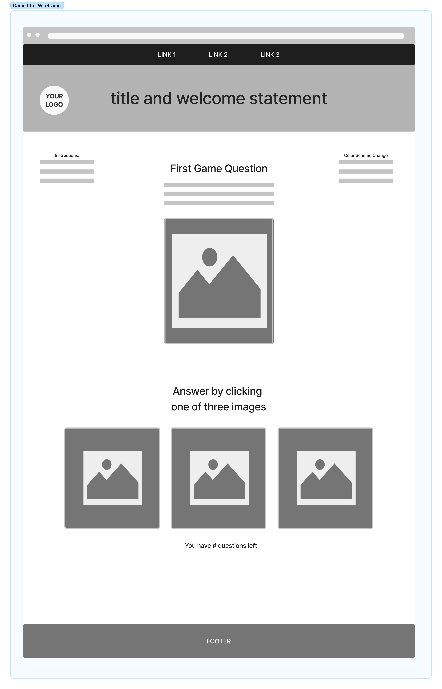
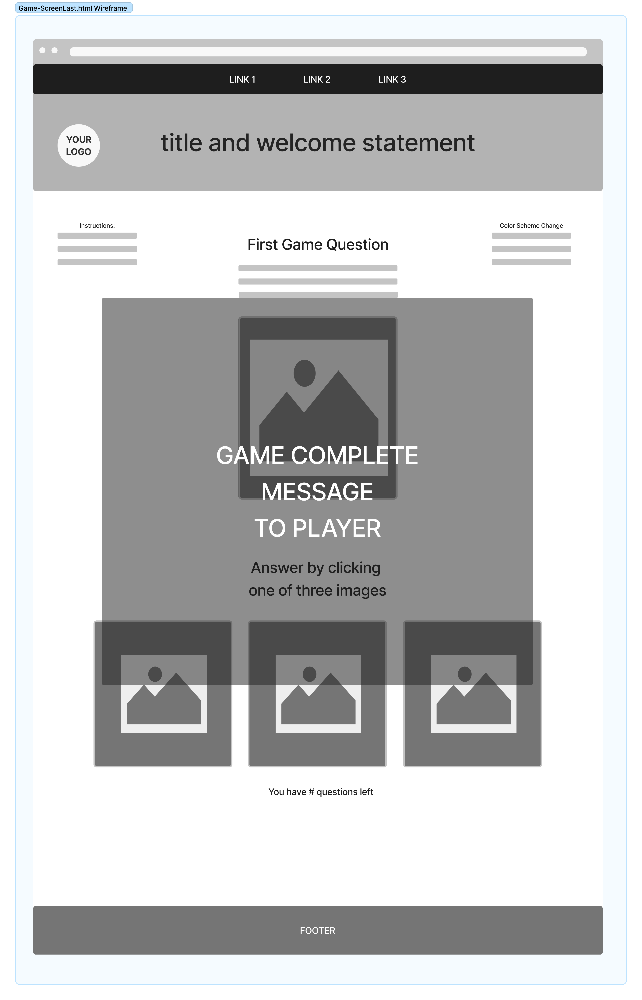
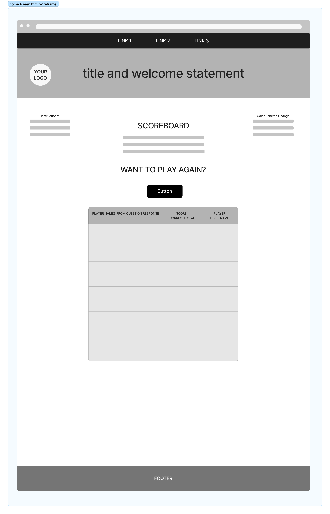
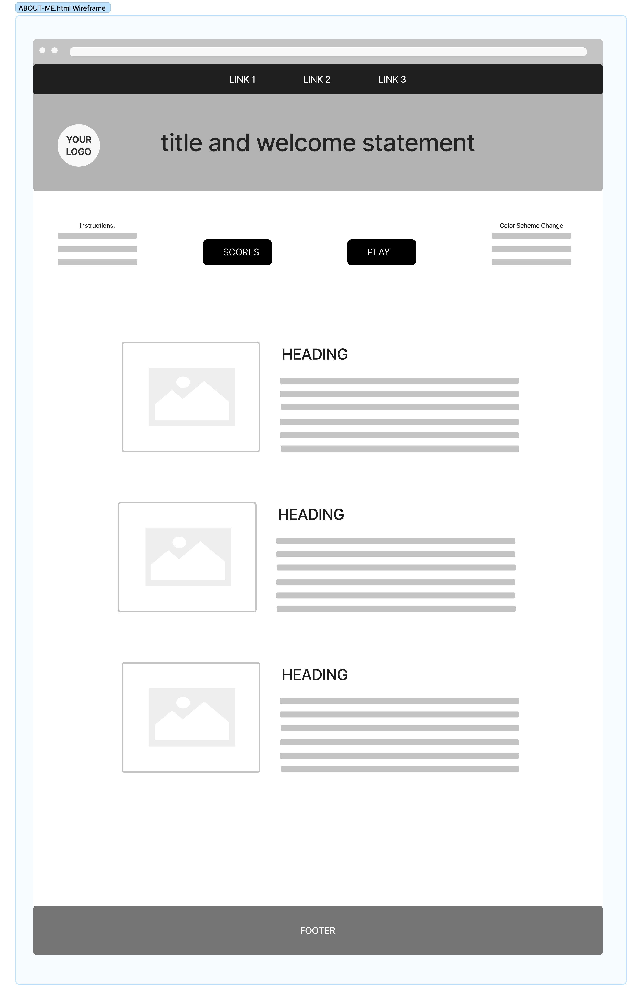
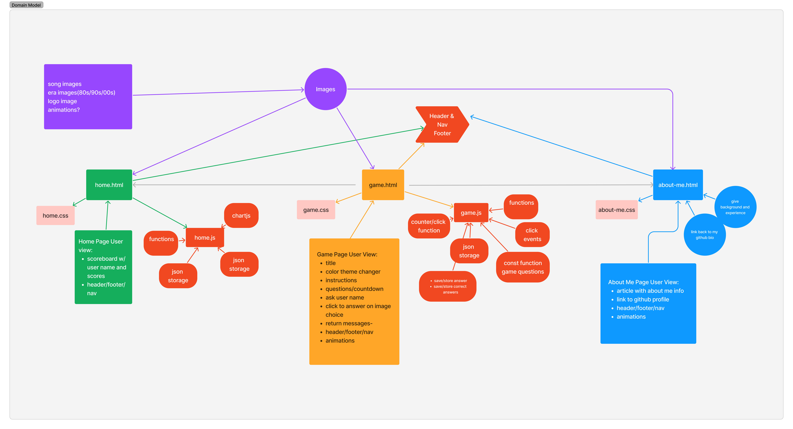

# guess-the-decade-game

## The name of the project

The Guess the Decade Game

### Names of the team members

Elizabeth Purtell

### A description of the project

### The overall problem domain and how the project solves those problems

### Semantic versioning, beginning with version 1.0.0 and incremented as changes are made

### A list of any libraries, frameworks, or packages that your application requires in order to properly function. If needed, provide instructions that the user may need to follow in order to get your application up and running on their own computer.

### User Stories

### Wireframe Images

### Lighthouse Images

### Reference Links

[submission PR](http://xyz.com)
[submission PR](http://xyz.com)
[submission PR](http://xyz.com)

### Domain Modeling

---
---
