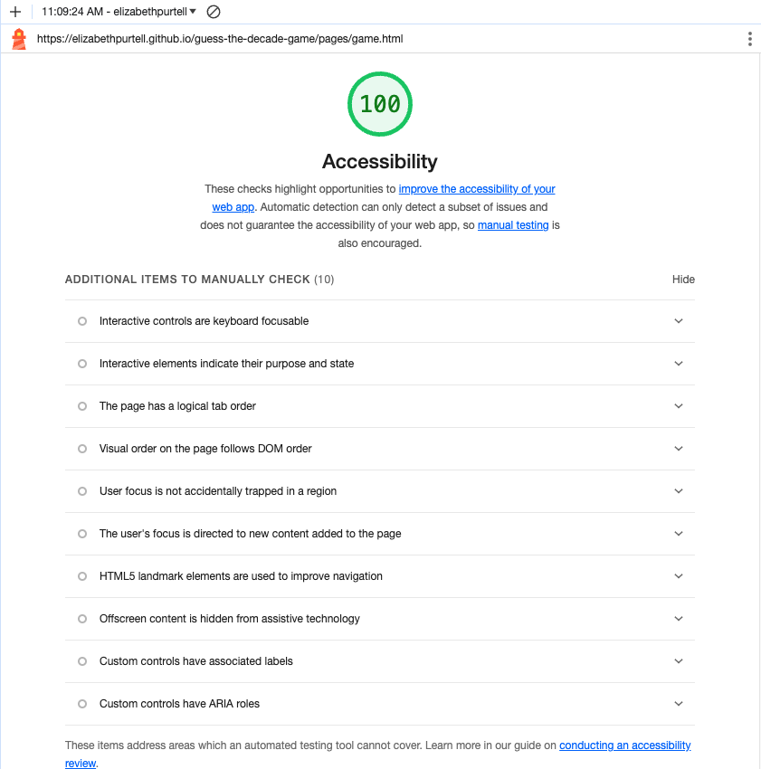

# Final Project - Code 201 - self-paced

## The name of the project

The Guess the Decade Game

### Names of the team members

Elizabeth Purtell

### A description of the project

I wanted to make something fun that also used a good collection of what I have learned in the last few months.

It solves burnout and gives the brain something different to focus on. This is a fun game to relax and blow off steam. It tests the user's knowledge of when certain songs came out. They can play against friends and return to see their scores.

### The overall problem domain and how the project solves those problems

Quiz Game:
    Asking questions about songs to determine which generation of music it came from. At the end they will be told their score with a message and a picture.

Key features:
    Receives players name to display in the scoreboard at the end
    Constructor for questions
    Event handlers for clicks
    Tracks score, then gives a rank which is then sent to the scoreboard via JSON localStorage
    Displays the name, score, & rank, plus the link to the scoreboard in a pop-up window at game end.

Technologies and languages:
    HTML, CSS, JavaScript, ChatGPT

### User Stories

### Wireframe Images

### Lighthouse Images

### Reference Links

[submission PR](http://xyz.com)
[submission PR](http://xyz.com)
[submission PR](http://xyz.com)

### Domain Modeling

---
---
